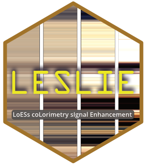

# LESLIE 

**L**o**ES**s co**L**orimetry s**I**gnal **E**nhancement

## License

This program is free software: you can redistribute it and/or modify it
under the terms of the GNU General Public License as published by the
Free Software Foundation, either version 3 of the License, or any later
version.

This program is distributed in the hope that it will be useful, but
WITHOUT ANY WARRANTY; without even the implied warranty of
MERCHANTABILITY or FITNESS FOR A PARTICULAR PURPOSE. See the [GNU
General Public
License](https://github.com/CLaag/LESLIE/blob/master/LICENSE) for
more details.
